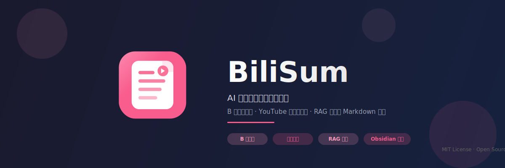
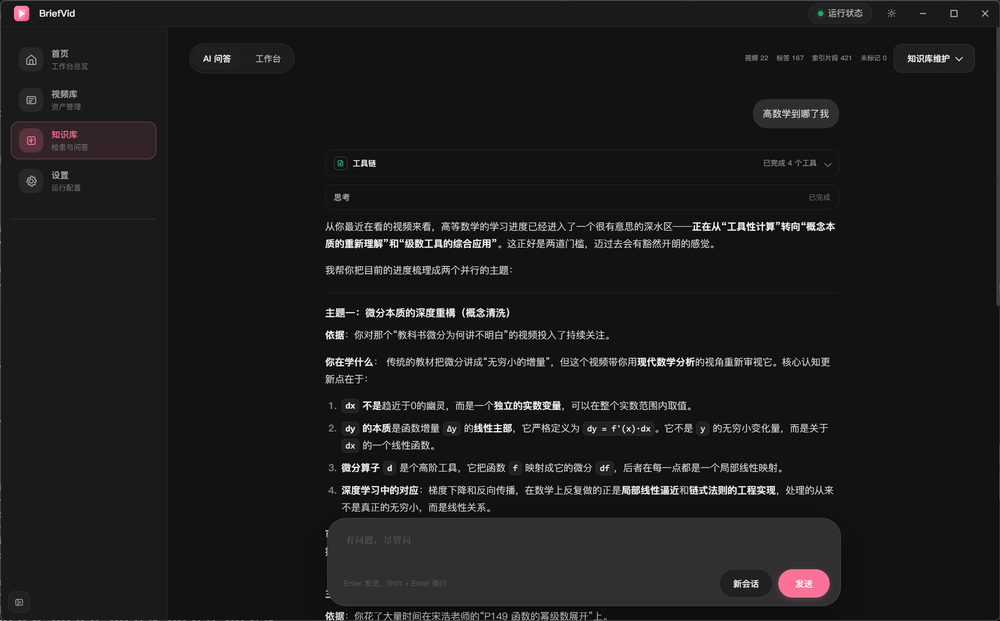
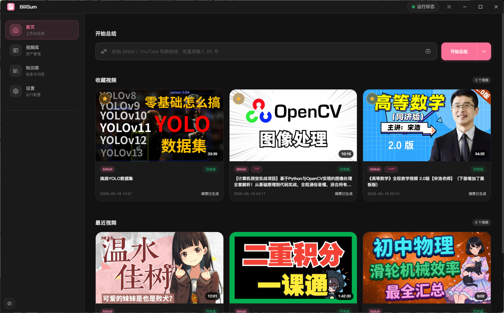

<div align="center">



# BiliSum

**AI 视频总结与知识库工具**

把 B 站、YouTube 和本地视频，沉淀成可检索、可追问、可导出的知识笔记。

[](https://www.python.org/downloads/)
[](https://opensource.org/licenses/MIT)
[](#)

[快速开始](#-快速开始) · [产品特性](#-产品特性) · [技术栈](#️-技术栈) · [贡献指南](#-贡献指南)

</div>

---

> 深度优化 B 站体验，同时支持 YouTube 与本地视频；自动转写、总结、生成知识卡片，并支持 RAG 问答与 Markdown / Obsidian 导出。

## 🌟 为什么需要 BiliSum

市面上的视频转写工具不少，但大多止步于"把话说完"——丢给你一段 transcript，或者一段泛泛的摘要。

**BiliSum 想做得更多：**

- 📚 **不止是转写** —— 自动拆解章节、提炼要点，生成结构化的知识卡片
- 🧠 **不止于单视频** —— 跨视频知识库，用 AI Agent 对整库内容进行检索与问答
- 🗃️ **沉淀为资产** —— 每个视频都是一条可追溯的知识条目，附带完整任务历史
- 🔄 **可反复打磨** —— 转写不满意？重新跑。摘要不够好？换套模型再来
- 🏠 **本地优先** —— 数据落本地，隐私可控，断网也能用

## 📸 产品速览

### 知识卡片视图

<div align="center">
  
  <p><i>核心概览 + 关键要点 + 章节时间轴，三栏布局清晰呈现</i></p>
</div>

### 笔记视图

<div align="center">
  
  <p><i>完整转写内容，支持数学公式、代码块等富文本格式</i></p>
</div>

### 思维导图视图

<div align="center">
  
  <p><i>放射状知识网络，内容结构和逻辑脉络一目了然</i></p>
</div>

### 知识库

<div align="center">
  
  <p><i>跨视频 AI 检索与问答，标签化管理，构建可生长的知识体系</i></p>
</div>

### 视频库首页

<div align="center">
  
  <p><i>统一管理已探测和已处理的视频，支持收藏与筛选</i></p>
</div>

## ✨ 产品特性

### 核心工作流

```
B 站 / YouTube / 本地视频 → 视频探测 → 下载/转写 → 结构化摘要 → 知识卡片 → 知识库入库
             ↓                              ↓                           ↓
        B 站扫码登录                   可回溯的任务历史              AI 检索问答
```

### 亮点能力

- **🧠 智能摘要引擎**
  - 不只是压缩内容，而是提炼知识骨架
  - 自动识别视频中的核心论点、案例和结论
  - 支持重新生成摘要，换套模型换个视角

- **🗄️ 知识库系统**
  - 跨视频 AI 知识检索与问答（RAG Agent）
  - 自动/手动标签管理，标签关系网络可视化
  - 语义搜索 + 关键词搜索，精准定位知识点
  - 可选本地 LLM，无需联网即可使用

- **📈 思维导图视图**
  - 把线性视频转换成放射状知识网络
  - 一眼看清内容结构和逻辑脉络
  - 支持缩放、拖拽、节点高亮互动

- **⚡ 学习效率倍增**
  - 1 小时视频 → 5 分钟快速掌握核心
  - 章节时间轴 + 关键句高亮，精准定位
  - 支持倍速浏览文字稿，比看字幕快 3 倍

- **📄 多 P 视频全覆盖**
  - 自动检测分 P 视频，支持选择单个分 P
  - 批量创建分 P 任务，独立生成摘要
  - 全集总结模式，聚合所有分 P 内容

- **📝 完整笔记 + 导出**
  - 逐字稿全文展示，支持搜索定位
  - 数学公式、代码块自动格式化
  - 一键导出为 Markdown / Obsidian 格式

- **🔐 B 站风控处理**
  - 桌面端一键扫码登录，自动保存 Cookies
  - 手动导入 cookies.txt 支持
  - 风控拦截自动提示并提供解决方案

- **📁 本地视频支持**
  - 导入本地 mp4 / mkv / mov / webm 等格式
  - 桌面端直接选取文件，浏览器端上传
  - 与在线视频完全相同的处理流程

- **🔄 灵活重跑机制**
  - `重新生成摘要`：复用转写，只重跑 LLM
  - `重新转写`：从音频开始全部重来

- **📊 实时进度透视**
  - REST + SSE 双通道同步任务状态
  - 任务悬浮窗实时查看队列与执行状态
  - 每个阶段在做什么，清清楚楚

- **▶️ YouTube 单视频支持**
  - 支持 `watch`、`youtu.be`、`shorts` 等常见单视频链接
  - 带 playlist 参数的单条视频会按当前视频处理

## 🛠️ 技术栈

| 模块 | 技术选型 |
|------|----------|
| 桌面端 | Electron + React + TypeScript + Vite |
| 后端服务 | FastAPI + SQLite |
| 视频下载 | yt-dlp |
| 语音转写 | SiliconFlow ASR / 本地 Whisper（可选） |
| 摘要生成 | OpenAI-compatible API / 本地规则降级 |
| 知识库 RAG | Embedding 向量检索 + LLM Agent |
| 思维导图 | ReactFlow |
| 知识网络 | D3 Force Graph |
| 打包分发 | PyInstaller onedir + electron-builder + Docker |

## 🚀 快速开始

### 环境要求

- Python **3.12**
- Node.js **20+**
- Windows 环境体验最佳
- 可选：`ffmpeg`、CUDA（本地 ASR 加速）

### npx 辅助入口

```powershell
npx bilisum
npx bilisum release
npx bilisum docker
```

`npx bilisum` 是轻量入口，用来查看最新版下载地址或快速拿到 Docker 启动命令；桌面端安装包仍通过 GitHub Releases 分发。

### 安装依赖

```powershell
# 推荐：使用 uv
uv sync --python 3.12 --all-packages

# 安装前端依赖
npm install --prefix .\apps\desktop
```

### 配置环境变量

```powershell
Copy-Item .env.example .env
```

编辑 `.env`，填入你的 API Key：

```env
# 服务配置
VIDEO_SUM_HOST=127.0.0.1
VIDEO_SUM_PORT=3838

# 转写服务（SiliconFlow）
VIDEO_SUM_TRANSCRIPTION_PROVIDER=siliconflow
VIDEO_SUM_SILICONFLOW_ASR_BASE_URL=https://api.siliconflow.cn/v1
VIDEO_SUM_SILICONFLOW_ASR_MODEL=TeleAI/TeleSpeechASR
VIDEO_SUM_SILICONFLOW_ASR_API_KEY=your-siliconflow-api-key

# LLM 摘要（可选，支持任意 OpenAI-compatible 接口）
VIDEO_SUM_LLM_ENABLED=true
VIDEO_SUM_LLM_BASE_URL=https://coding.dashscope.aliyuncs.com/v1
VIDEO_SUM_LLM_MODEL=qwen3.5-plus
VIDEO_SUM_LLM_API_KEY=your-llm-api-key

# B 站 Cookies（可选，遇到风控时配置）
VIDEO_SUM_YTDLP_COOKIES_FILE=
```

### 启动开发环境

```powershell
npm run dev
```

这条命令会同时拉起：
- Vite 渲染层
- Electron 桌面壳
- Python 后端服务

### 桌面端打包

```powershell
npm run package:win
```

### Docker 浏览器版

Docker 分发提供的是 `Python 后端 + 自带静态前端` 的浏览器访问形态，不包含 Electron 桌面壳。
镜像内默认内置静态版 `ffmpeg/ffprobe`，不会再额外拉进整套 Debian 多媒体运行库。

#### 本地构建镜像

```powershell
npm run docker:build
```

#### 运行容器

```powershell
docker run --rm ^
  -p 3838:3838 ^
  -v bilisum-data:/data ^
  -e VIDEO_SUM_LLM_ENABLED=true ^
  -e VIDEO_SUM_LLM_BASE_URL=https://coding.dashscope.aliyuncs.com/v1 ^
  -e VIDEO_SUM_LLM_MODEL=qwen3.5-plus ^
  -e VIDEO_SUM_LLM_API_KEY=your-llm-api-key ^
  -e VIDEO_SUM_SILICONFLOW_ASR_API_KEY=your-siliconflow-api-key ^
  lycohana/bilisum:latest
```

启动后直接访问 `http://127.0.0.1:3838`。

容器内默认约定：
- 服务监听 `0.0.0.0:3838`
- 数据目录为 `/data`
- SQLite 数据库默认写入 `/data/video_sum.db`
- 缓存目录为 `/data/cache`
- 任务产物目录为 `/data/tasks`

#### 拉取正式发布镜像

每次 tag 发版都会同步发布 Docker Hub 镜像：

```powershell
docker pull lycohana/bilisum:latest
# 或者使用带版本号的 tag
docker pull lycohana/bilisum:v1.11.0
```

### 从旧版迁移

BiliSum 会在首次启动时自动从旧的 BriefVid 目录迁移本地数据：

- `%LOCALAPPDATA%\briefvid\data` → `%LOCALAPPDATA%\bilisum\data`
- `%LOCALAPPDATA%\briefvid\runtime` → `%LOCALAPPDATA%\bilisum\runtime`
- 旧桌面端偏好、B 站登录态和 cookies 会复制到新的 BiliSum 用户目录

迁移只复制新目录中缺失的文件，不覆盖已有数据，也不会删除旧目录。

## 📦 项目结构

```
BiliSum/
├── apps/
│   ├── desktop/       # Electron + React 桌面端
│   │   ├── src/
│   │   │   ├── pages/      # 页面组件（首页/视频库/知识库/详情页/设置）
│   │   │   │   └── KnowledgePage/  # 知识库页面（问答/检索/标签/网络）
│   │   │   ├── components/ # 通用 UI 组件
│   │   │   ├── api.ts      # API 客户端
│   │   │   └── appModel.ts # 状态管理
│   │   └── build/          # 构建产物
│   ├── web/           # 浏览器版静态产物目录（由 desktop renderer 构建写入）
│   └── service/       # FastAPI 本地服务
│       └── src/
│           └── video_sum_service/
│               ├── app.py             # FastAPI 应用入口
│               ├── main.py            # 服务启动逻辑
│               ├── worker.py          # 后台任务调度与执行
│               ├── repository.py      # SQLite 数据持久化
│               ├── schemas.py         # API 数据模型
│               ├── task_exports.py    # 笔记导出（Markdown / Obsidian）
│               ├── runtime_support.py # 运行时环境检测与维护
│               ├── settings_manager.py # 配置管理
│               ├── knowledge/         # 知识库子系统
│               │   ├── index_service.py  # 知识索引构建
│               │   ├── rag_service.py    # RAG 检索增强生成
│               │   ├── tag_service.py    # 标签管理
│               │   └── local_llm.py      # 本地 LLM 接入
│               └── routers/           # API 路由
├── packages/
│   ├── core/          # 下载、转写、摘要核心逻辑
│   │   └── src/video_sum_core/
│   │       ├── pipeline/        # 流程编排
│   │       ├── models/          # 领域模型
│   │       └── markdown_exports.py  # Markdown 导出引擎
│   └── infra/         # 配置、运行时、基础设施
│       └── src/video_sum_infra/
│           ├── config/   # 配置管理
│           └── runtime/  # 运行时引导
├── docs/pic/          # 文档资源
├── Dockerfile         # Docker 浏览器版镜像定义
├── scripts/           # PowerShell 工具脚本
├── build/pyinstaller/ # PyInstaller 打包配置
├── tests/             # 测试用例
└── .env.example       # 环境变量模板
```

## 🤝 贡献指南

欢迎以任意方式参与 BiliSum 的成长：

### 你可以贡献什么

- 🐛 **提交 Issue**：遇到 Bug 或有功能建议，直接开 Issue
- 🔧 **提交 PR**：修复 Bug、新增功能、优化体验均可
- 📝 **完善文档**：补充使用说明、优化文案、增加示例
- 💡 **分享用例**：在你的工作流中使用 BiliSum，欢迎分享经验


### 代码风格

- Python：遵循 PEP 8，类型注解优先
- TypeScript：严格模式，React 组件使用函数式写法
- Commit 信息：参考 [Conventional Commits](https://www.conventionalcommits.org/)

## 👨‍💻 开发流程

### 1. 初始化开发环境

项目使用 `uv workspace` 管理 `apps/service`、`packages/core`、`packages/infra` 三个 Python 包。

首次拉取代码后，推荐先执行：

```powershell
uv sync --python 3.12 --all-packages
npm install --prefix .\apps\desktop
```

这一步会把 workspace 成员同步到当前虚拟环境，后续开发时 `video_sum_service` / `video_sum_core` 会直接指向本地源码。

### 2. 启动后端服务

推荐使用 `uv run`，这是当前最稳的跨平台启动方式：

```powershell
uv run --package video-sum-service python -m video_sum_service
```

如果你已经激活了虚拟环境，也可以直接运行：

```powershell
python -m video_sum_service
```

### 3. 启动桌面端开发环境

```powershell
npm run dev
```

这条命令会启动：

- Vite 渲染层
- Electron 桌面壳
- Python 本地后端服务

### 4. 常用开发验证

Python 单测：

```powershell
.\.venv\Scripts\python -m pytest
```

桌面端测试：

```powershell
npm test --prefix .\apps\desktop
```

桌面端类型检查：

```powershell
npm run typecheck --prefix .\apps\desktop
```

### 5. macOS / Linux 说明

PowerShell 脚本主要用于 Windows 辅助开发；在 macOS / Linux 上，推荐统一使用：

```bash
uv sync --python 3.12 --all-packages
uv run --package video-sum-service python -m video_sum_service
npm run dev
```

### 6. 遇到"代码已修改，但运行时还是旧逻辑"怎么办？

先检查当前解释器导入的是不是源码路径：

```powershell
uv run --package video-sum-service python -c "import video_sum_core, video_sum_service; print(video_sum_core.__file__); print(video_sum_service.__file__)"
```

如果输出不是仓库内的 `packages/core/src/...`、`apps/service/src/...`，通常说明当前环境还没有重新同步，可以重新执行：

```powershell
uv sync --python 3.12 --all-packages
```

## 🔮 路线图

- [x] 思维导图视图
- [x] 本地视频导入与处理
- [x] 知识笔记导出为 Markdown / Obsidian
- [x] 知识库系统（RAG 检索问答、标签管理、知识网络）
- [x] B 站风控处理（扫码登录、Cookies 管理）
- [x] 多 P 视频批量处理与全集总结
- [x] GPU 运行时一键安装与管理
- [x] 桌面端自动更新
- [x] 任务调度与中断恢复
- [ ] 更多视频平台支持
- [ ] 与 Notion 等第三方知识管理工具集成
- [ ] 知识卡片导出为 Notion

## 📄 License

MIT License © 2026 Lycohana


<div align="center">
  <sub>Built with ❤️ by Lycohana</sub>
</div>
