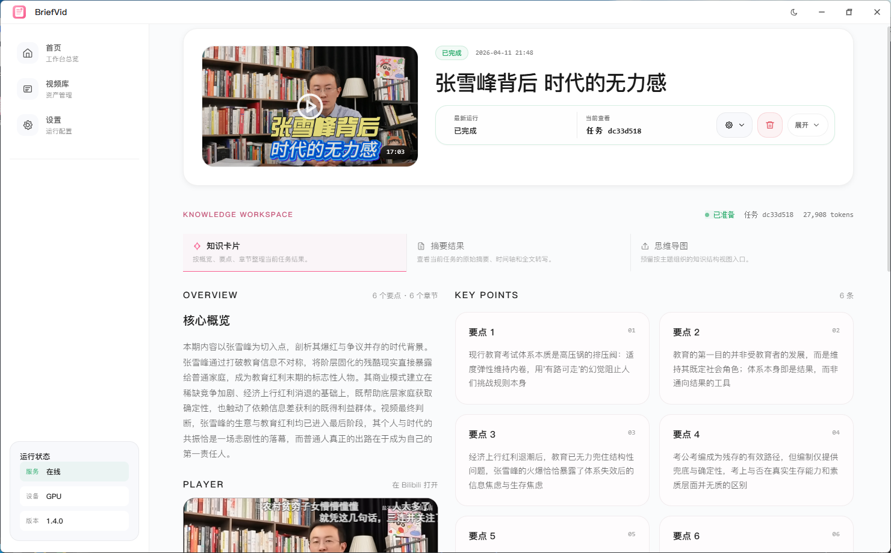

# BriefVid

[](https://www.python.org/downloads/)
[](https://opensource.org/licenses/MIT)
[](#)

本地优先的视频知识工作台。输入 B 站视频链接，自动完成探测、下载、转写、结构化摘要，并把结果整理成可回看、可复用的知识卡片与任务历史。




## 产品定位

BriefVid 不是单纯的“字幕转写工具”，也不是只返回一段泛泛摘要的 LLM Demo。

它更像一个围绕视频内容整理建立的个人知识工作台：

- 一次导入视频，沉淀为本地视频库
- 一次处理任务，沉淀为可追溯的转写、摘要和章节结构
- 同一个视频，可以反复刷新信息、重新转写、只重跑摘要
- 所有结果默认落本地，便于归档、复查和后续二次处理

## 核心能力

- 视频探测与入库：解析 B 站链接，缓存封面、标题、时长等元数据
- 后台任务处理：下载音频、执行转写、生成结构化摘要，并保存完整任务历史
- 知识卡片视图：将概览、要点、章节拆成适合阅读和复用的内容单元
- 摘要结果视图：保留更完整的概览、时间轴和全文转写
- 任务版本管理：支持查看历史版本、删除任务、刷新源站信息
- 双重重跑机制：
  - `重新生成摘要`：复用现有转写与分段，只重新调用 LLM
  - `重新转写生成摘要`：重新抓取音频、重新转写，再生成新摘要
- 实时进度反馈：通过 REST + SSE 同步任务状态与阶段事件
- 本地优先部署：桌面端可直接拉起本地服务，Windows 分发不依赖用户预装 Python

## 适合谁

- 想把长视频整理成结构化知识的人
- 需要快速回顾视频重点、章节推进和原始转写的人
- 想把视频内容纳入个人资料库、本地知识库或后续工作流的人

## 产品结构

### 1. 视频库

统一管理已探测和已处理的视频资源，保留封面、状态、最新任务结果和更新时间。

### 2. 视频详情页

围绕单个视频构建完整工作台：

- 左侧查看核心概览和内嵌播放器
- 右侧阅读关键要点
- 下方浏览章节卡片并回跳播放器时间点
- 顶部切换知识卡片、摘要结果、思维导图入口
- 悬浮任务面板中查看实时进度与版本历史

### 3. 设置页

集中管理模型、运行时、CUDA 安装、服务日志与本地服务状态。

## 技术栈

| 模块 | 技术 |
| --- | --- |
| Desktop | Electron |
| Frontend | React + TypeScript + Vite |
| Backend | FastAPI |
| Database | SQLite |
| Download | `yt-dlp` |
| Transcription | `faster-whisper` / SiliconFlow ASR |
| Summarization | OpenAI-compatible API / 本地规则降级 |
| Packaging | PyInstaller onedir |

## 快速开始

### 环境要求

- Python `3.12`
- Node.js `20+`
- Windows 开发和打包环境最佳
- 建议可用 `ffmpeg`
- 如需 LLM 摘要，需要可用的 OpenAI-compatible 接口

### 安装依赖

推荐：

```powershell
uv sync --python 3.12 --all-packages
npm install --prefix .\apps\desktop
```

兼容方式：

```powershell
python -m pip install -e .\packages\infra -e .\packages\core -e .\apps\service
npm install --prefix .\apps\desktop
```

### 配置环境变量

```powershell
Copy-Item .env.example .env
```

示例：

```env
VIDEO_SUM_HOST=127.0.0.1
VIDEO_SUM_PORT=3838
VIDEO_SUM_TRANSCRIPTION_PROVIDER=local
VIDEO_SUM_WHISPER_MODEL=tiny
VIDEO_SUM_WHISPER_DEVICE=cpu
VIDEO_SUM_WHISPER_COMPUTE_TYPE=int8
VIDEO_SUM_SILICONFLOW_ASR_BASE_URL=https://api.siliconflow.cn/v1
VIDEO_SUM_SILICONFLOW_ASR_MODEL=TeleAI/TeleSpeechASR
VIDEO_SUM_SILICONFLOW_ASR_API_KEY=replace-with-your-siliconflow-api-key
VIDEO_SUM_LLM_ENABLED=true
VIDEO_SUM_LLM_BASE_URL=https://coding.dashscope.aliyuncs.com/v1
VIDEO_SUM_LLM_MODEL=qwen3.5-plus
VIDEO_SUM_LLM_API_KEY=replace-with-your-api-key
```

如果想改用硅基流动语音识别：

```env
VIDEO_SUM_TRANSCRIPTION_PROVIDER=siliconflow
VIDEO_SUM_SILICONFLOW_ASR_BASE_URL=https://api.siliconflow.cn/v1
VIDEO_SUM_SILICONFLOW_ASR_MODEL=TeleAI/TeleSpeechASR
VIDEO_SUM_SILICONFLOW_ASR_API_KEY=your-api-key
```

说明：

- 当前首批支持 `TeleAI/TeleSpeechASR`
- SiliconFlow 转写接口返回纯文本时，BriefVid 会自动补建分段与时间轴，保证后续摘要链路可直接使用
- 如果暂时不想接 LLM，可将 `VIDEO_SUM_LLM_ENABLED=false`，系统会回退到本地规则摘要

### 启动开发环境

```powershell
npm run dev
```

这条命令会同时启动：

- Vite 渲染层
- Electron 桌面壳
- 本地 Python 后端服务

如果只想单独启动后端：

```powershell
python -m video_sum_service
```

或：

```powershell
.\scripts\run_service.ps1
```

## 常用接口

### 系统与设置

- `GET /health`
- `GET /api/v1/system/info`
- `GET /api/v1/environment`
- `GET /api/v1/settings`
- `PUT /api/v1/settings`
- `POST /api/v1/cuda/install`

### 视频与任务

- `POST /api/v1/videos/probe`
- `GET /api/v1/videos`
- `GET /api/v1/videos/{video_id}`
- `DELETE /api/v1/videos/{video_id}`
- `GET /api/v1/videos/{video_id}/tasks`
- `POST /api/v1/videos/{video_id}/tasks`
- `POST /api/v1/videos/{video_id}/tasks/resummary`
- `GET /api/v1/tasks/{task_id}/result`
- `GET /api/v1/tasks/{task_id}/events`
- `GET /api/v1/tasks/{task_id}/events/stream`
- `DELETE /api/v1/tasks/{task_id}`

## 输出结果

每个任务都会在本地生成可复用结果文件：

- `transcript.txt`
- `summary.json`

其中 `summary.json` 同时包含：

- 标题
- 结构化摘要
- 分段信息

这也是“只重新生成摘要”能力可以复用已有文本和分段的基础。

## Windows 打包

构建完整桌面包：

```powershell
npm run package:win
```

或：

```powershell
npm run build:win
```

## 项目结构

```text
apps/
  desktop/   Electron + React 桌面端
  service/   FastAPI 本地服务
packages/
  core/      下载、转写、摘要核心流程
  infra/     配置、运行时、基础设施
docs/
  pic/       README 截图等文档资源
scripts/
  *.ps1      常用开发脚本
```

## 路线方向

- 更完整的思维导图视图
- 更细粒度的知识卡片导出
- 更多视频来源支持
- 更稳定的 GPU 与运行时管理
- 更完整的本地知识库工作流接入

## License

MIT
